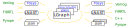

# LiveHD: Live Hardware Development

Code quality: [](https://www.codefactor.io/repository/github/masc-ucsc/livehd)
[](https://coveralls.io/github/masc-ucsc/livehd?branch=HEAD)

Short CI: [](https://travis-ci.org/masc-ucsc/livehd)
Long CI: [](https://dev.azure.com/renau0400/renau/_build/latest?definitionId=2&branchName=master)

LiveHD is an infrastructure designed for Live Hardware Development. By live, we
mean that small changes in the design should have the synthesis and simulation
results in a few seconds, as the fast interactive systems usually response in
sub-second.

As the goal of "seconds," we do not need to perform too fine grain incremental
work. Notice that this is a different goal from having an typical incremental
synthesis, where many edges are added and removed in the order of thousands of
nodes/edges. 


## LiveHD Framework
LiveHD is optimized for synthesis and simulation. The main components of LiveHD
includes LGraph, LNAST, integrated 3rd-party tools, code generation, and "live"
techniques. The core of LiveHD is a graph structure called LGraph (Live Graph).
LGraph is built for fast synthesis and simulation, and interfaces other tools
like Yosys, ABC, OpenTimer, and Mockturtle. LNAST stands for language neutral
AST, which is a high-level IR on both front/back-end of LGraph. LNAST helps to
bridge different HDLs and HLS into LiveHD and is useful for HDLs/C++ code
generation.



## Contribute to LiveHD
There is a list of available [projects.md](docs/projects.md) to further improve
LiveHD. If you want to contribute or seek for MS/undergraduate thesis projects, please
contact renau@ucsc.edu to query about them.

## Building

LiveHD uses bazel as a build system, it requires gcc/clang 8 or newer to
support all the c++17 features. [Bazel.md](docs/Bazel.md) has more details
about how to build, test, and debug with bazel.

For a simple release build:

```
$ bazel build //main:lgshell
```

## LiveHD Data Structures

LiveHD has several custom data structures, the two more important are
[LGraph](docs/lgraph.md) and [LNAST](https://masc.soe.ucsc.edu/lnast-doc).

LGraph (Live hardware Graph) is the graph-like data structure and associated
API inside LiveHD. LNAST (Language Neutral AST) is the tree-like structure and
associated API to easily create new input languages to LiveHD.

## InOu

InOus are inputs and/or outputs to/from LiveHD. An input will create a LGraph,
e.g., from a verilog description, an json representation, or randomly.
Similarly, an output will read an existing LGraph and generate an alternative
representation, eg., verilog or json.

Examples of inou can be found in inou/yosys (for verilog handling) and inou/json.

## Passes

Passes are transformations over an existing LGraph. In the future, there may be
passes over LNAST, but for the moment, we just have LGraph passes. A pass will
read an LGraph and make changes to it. Usually this is done for optimizations.
Examples of passes can be found in `pass/sample`, which compute the histogram
and count wire numbers of a LGraph.

## Style

For coding, please follow the coding styles from [Style.md](docs/Style.md). To contribute,
check [policy](docs/CONTRIBUTING.md) document that explains how to create pull requests
and more details about license and copyrights. Also, contributors to LiveHD are
expected to adhere to the [Code of Conduct](docs/CODE_OF_CONDUCT.md).

## Code Organization

The code is organized as:

- [`core/`](./core) - All the core classes of LGraph (nodes, edges, iterators, field tables, ...)
- [`meta/`](./meta) - All the additional fields added to the nodes
- [`inou/`](./inou) - All the inputs and outputs to and from LGraph
- [`pass/`](./pass) - Transformations over LGraph
- [`cops/`](./cops) - Combine operations, ie. take N graphs and creates another graph
- [`misc/`](./misc) - External libraries and other misc code
- [`test/`](./test) - Testing code, scripts, cases and infrastructure (Note: unit tests
  should be placed inside the corresponding subfolder)
- [`docs/`](./docs) - Documentation of LiveHD

## Git Policies

Before pushing your code, make sure:

* The code builds `bazel build //...`
* The testbenches pass `bazel test //...`

Push frequently, if your code still has problems, use macros to turn parts of it
off:

```cpp
#if 0
//...
#endif
```

Pull at least once a day when working, LiveHD is in active development.

Always target warning free compilation. It is okay to commit code that triggers
warning during development, but remember to clean up afterwards.

If you are not one of the code owners, you need to create a pull request as
indicated in [CONTRIBUTING.md](docs/CONTRIBUTING.md) and [GitHub-use.md](docs/GitHub-use.md).


# Publications
For more detailed information and paper reference, please refer to 
the following publications. If you are doing research or projects corresponding
to LiveHD, please send us a notification, we are glad to add your paper.

## Live techniques 
1. [LiveHD: A Productive Live Hardware Development Flow](docs/papers/LiveHD_IEEE_Micro20.pdf), Sheng-Hong Wang, Rafael T. Possignolo, Haven Skinner, and Jose Renau, IEEE Micro Special Issue on Agile and Open-Source Hardware, July/August 2020. 


2. [LiveSim: A Fast Hot Reload Simulator for HDLs](docs/papers/LiveSim_ISPASS20.pdf), Haven Skinner, Rafael T. Possignolo, Sheng-Hong Wang, and Jose Renau, International Symposium on Performance Analysis of Systems and Software (ISPASS), April 2020. **(Best Paper Nomination)**

3. [SMatch: Structural Matching for Fast Resynthesis in FPGAs](docs/papers/SMatch_DAC19.pdf), Rafael T.
   Possignolo and Jose Renau, Design Automation Conference (DAC), June 2019.

4. [LiveSynth: Towards an Interactive Synthesis Flow](docs/papers/LiveSynth_DAC17.pdf), Rafael T. Possignolo, and
   Jose Renau, Design Automation Conference (DAC), June 2017.

## LGraph 
5. [LGraph: A Unified Data Model and API for Productive Open-Source Hardware Design](docs/papers/LGraph_WOSET19.pdf), 
   Sheng-Hong Wang, Rafael T. Possignolo, Qian Chen, Rohan Ganpati, and
   Jose Renau, Second Workshop on Open-Source EDA Technology (WOSET), November 2019.

6. [LGraph: A multi-language open-source database for VLSI](docs/papers/LGraph_WOSET18.pdf), Rafael T. Possignolo,
   Sheng-Hong Wang, Haven Skinner, and Jose Renau. First Workshop on Open-Source
   EDA Technology (WOSET), November 2018. **(Best Tool Nomination)**

## LNAST 
7. [LNAST: A Language Neutral Intermediate Representation for Hardware Description Languages](docs/papers/LNAST_WOSET19.pdf), Sheng-Hong Wang, Akash Sridhar, and Jose Renau,
   Second Workshop on Open-Source EDA Technology (WOSET), 2019.


> :warning: LiveHD is under active development and we keep improving the API.
> Breaks in compatibility would not happen unless justified, but expect to be
