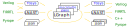

# LiveHD: Live Hardware Development

## Summary

[](https://www.codefactor.io/repository/github/masc-ucsc/livehd)
[](https://codecov.io/gh/masc-ucsc/livehd)
[](https://github.com/masc-ucsc/livehd/actions/workflows/ubuntu.yml)


LiveHD is a "compiler" infrastructure for hardware design optimized for
synthesis and simulation. The goals is to enable a more productive flow where
the ASIC/FPGA designer can work with multiple hardware description languages
like Pyrope or Verilog. In the past, it supported CHISEL, but the code is deprecated.


## Goal

LiveHD: a fast and friendly hardware development flow that you can trust

To be "Fast", LiveHD aims to be parallel, scalable, and incremental/live flow.

To be "friendly", LiveHD aims to build new models to have good error reporting.

To "trust", LiveHD has CI and many random tests with logic equivalence tests (LEC).

> :warning: LiveHD is beta under active development and we keep improving the
> API. Semantic versioning is a 0.+, significant API changes are expect.


## LiveHD Framework


LiveHD stands for Live Hardware Development. By live, we mean that small
changes in the design should have the synthesis and simulation results in a few
seconds.

As the goal of "seconds," we do not need to perform too fine grain incremental
work. Notice that this is a different goal from having an typical incremental
synthesis, where many edges are added and removed in the order of thousands of
nodes/edges.

LiveHD is optimized for synthesis and simulation. The main components of LiveHD
includes LGraph, LNAST, integrated 3rd-party tools, code generation, and "live"
techniques. The core of LiveHD is a graph structure called LGraph (Live Graph).
LGraph is built for fast synthesis and simulation, and interfaces other tools
like Yosys, ABC, OpenTimer, and Mockturtle. LNAST stands for language neutral
AST, which is a high-level IR on both front/back-end of LGraph. LNAST helps to
bridge different HDLs and HLS into LiveHD and is useful for HDLs/C++ code
generation.



## Contribute to LiveHD

Contributors are welcome to the LiveHD project. This project is led by the
[MASC group](https://masc.soe.ucsc.edu) from UCSC.

There is a list of available [projects.md](docs/projects.md) to further improve
LiveHD. If you want to contribute or seek for MS/undergraduate thesis projects,
please contact renau@ucsc.edu to query about them.


You can also
[donate](https://secure.ucsc.edu/s/1069/bp18/interior.aspx?sid=1069&gid=1001&pgid=780&cid=1749&dids=1053)
to the LiveHD project. The funds will be used to provide food for meetings,
equipment, and support to students/faculty at UCSC working on this project.


The instructions for installation and internal LiveHD passes can be found at
[Documentation](https://masc-ucsc.github.io/docs/livehd/00-intro/)


If you are not one of the code owners, you need to create a pull request as
indicated in [CONTRIBUTING.md](docs/CONTRIBUTING.md).


# Publications
For more detailed information and paper reference, please refer to
the following publications. If you are doing research or projects corresponding
to LiveHD, please send us a notification, we are glad to add your paper.

1. [A Multi-threaded Fast Hardware Compiler for HDLs](docs/papers/livehd_cc23.pdf), Sheng-Hong Wang, Hunter Coffman, Kenneth Mayer, Sakshi Garg, and Jose Renau. International Conference on Compiler Construction (CC), February 2023.

2. [LiveHD: A Productive Live Hardware Development Flow](docs/papers/LiveHD_IEEE_Micro20.pdf), Sheng-Hong Wang, Rafael T. Possignolo, Haven Skinner, and Jose Renau, IEEE Micro Special Issue on Agile and Open-Source Hardware, July/August 2020.

3. [LiveSim: A Fast Hot Reload Simulator for HDLs](docs/papers/LiveSim_ISPASS20.pdf), Haven Skinner, Rafael T. Possignolo, Sheng-Hong Wang, and Jose Renau, International Symposium on Performance Analysis of Systems and Software (ISPASS), April 2020. **(Best Paper Nomination)**

4. [SMatch: Structural Matching for Fast Resynthesis in FPGAs](docs/papers/SMatch_DAC19.pdf), Rafael T.
   Possignolo and Jose Renau, Design Automation Conference (DAC), June 2019.

5. [LiveSynth: Towards an Interactive Synthesis Flow](docs/papers/LiveSynth_DAC17.pdf), Rafael T. Possignolo, and
   Jose Renau, Design Automation Conference (DAC), June 2017.

## LGraph

6. [LGraph: A Unified Data Model and API for Productive Open-Source Hardware Design](docs/papers/LGraph_WOSET19.pdf),
   Sheng-Hong Wang, Rafael T. Possignolo, Qian Chen, Rohan Ganpati, and
   Jose Renau, Second Workshop on Open-Source EDA Technology (WOSET), November 2019.

7. [LGraph: A multi-language open-source database for VLSI](docs/papers/LGraph_WOSET18.pdf), Rafael T. Possignolo,
   Sheng-Hong Wang, Haven Skinner, and Jose Renau. First Workshop on Open-Source
   EDA Technology (WOSET), November 2018. **(Best Tool Nomination)**

## LNAST

8. [LNAST: A Language Neutral Intermediate Representation for Hardware
   Description Languages](docs/papers/LNAST_WOSET19.pdf), Sheng-Hong Wang,
   Akash Sridhar, and Jose Renau, Second Workshop on Open-Source EDA Technology
   (WOSET), 2019.


# Pyrope

[Pyrope](https://masc.soe.ucsc.edu/pyrope.html) is the primary HDL for LiveHD.
LiveHD ships a **Pyrope language server (LSP)** so editors and coding agents get
live compile diagnostics (syntax, name, type, bit-width) on `.prp` files. See
the design at [docs/contracts/pyrope_lsp.md](docs/contracts/pyrope_lsp.md).

## Language server

The server runs as `lhd lsp` over stdio (JSON-RPC). It is Pyrope-only
(`.prp`); it never touches the Verilog/Yosys path. (The deprecated
`lgshell --lsp` spelling still works during the transition.)

Build it once:

```bash
bazel build -c dbg //lhd:lhd
# binary at: bazel-bin/lhd/lhd
```

#### `prplsp` launcher

Rather than hard-code a path, point your editor at the
[`scripts/prplsp`](scripts/prplsp) wrapper. It runs `lhd lsp`, but picks
*which* `lhd` based on the directory the editor launched in:

- **Inside a livehd checkout** → that checkout's freshly-built
  `bazel-bin/lhd/lhd`, so iterating on the LSP needs no copy/reinstall.
- **Anywhere else** → the `lhd` found on your `$PATH` (the default install;
  a legacy `lgshell` on `$PATH` still works as a deprecated fallback).

So you keep one editor config everywhere. Install both `prplsp` and a default
`lhd` on your `$PATH` — e.g. into `~/bin` or `~/.local/bin`:

```bash
cp scripts/prplsp ~/.local/bin/prplsp    # or: ln -s "$PWD/scripts/prplsp" ~/.local/bin/
cp bazel-bin/lhd/lhd ~/.local/bin/lhd    # the fallback used outside a checkout
```

Quick sanity check (it should print a framed JSON-RPC reply, then exit):

```bash
printf 'Content-Length: 58\r\n\r\n{"jsonrpc":"2.0","id":1,"method":"initialize","params":{}}' \
  | ./scripts/prplsp
```

What it provides today (Phase A): real-time diagnostics via
`textDocument/publishDiagnostics` (and the LSP 3.17 pull model). Hover, go-to
definition/references, and document symbols are planned (see the contract).


### Claude Code

Claude Code consumes LSP servers through a plugin's `.lsp.json`. Create a small
plugin directory (the LSP schema is evolving — verify against the current
[plugin reference](https://code.claude.com/docs/en/plugins-reference)):

```
pyrope-lsp-plugin/
  plugin.json      # { "name": "pyrope-lsp", "version": "0.1.0" }
  .lsp.json
```

`.lsp.json`:

```json
{
  "pyrope": {
    "command": "prplsp",
    "args": [],
    "transport": "stdio",
    "extensionToLanguage": { ".prp": "pyrope" }
  }
}
```

Then load it for development with `claude --plugin-dir ./pyrope-lsp-plugin` (or
install it via `/plugin install`) and `/reload-plugins`. Editing a `.prp` file
will then surface Pyrope diagnostics to Claude. For an in-IDE session (VS Code /
JetBrains), Claude reads the editor's Problems panel via the built-in `ide` MCP
server instead, so point your IDE's Pyrope LSP at `prplsp` too.

### Neovim (0.11+)

[`scripts/pyrope.lua`](scripts/pyrope.lua) is a ready-made
[lazy.nvim](https://github.com/folke/lazy.nvim) plugin spec that wires up the
whole experience: the `.prp` filetype, tree-sitter syntax highlighting (via
[tree-sitter-pyrope](https://github.com/masc-ucsc/tree-sitter-pyrope)), `//`
comment support, and the `prplsp` language server. Drop it into your plugins
directory, restart, and run `:TSInstall pyrope` once:

```bash
cp scripts/pyrope.lua ~/.config/nvim/lua/plugins/pyrope.lua
```

If you don't use lazy.nvim (or only want the language server), the minimal
wiring is just:

```lua
vim.filetype.add({ extension = { prp = "pyrope" } })

vim.api.nvim_create_autocmd("FileType", {
  pattern = "pyrope",
  callback = function(args)
    vim.lsp.start({
      name      = "livehd",
      cmd       = { "prplsp" },  -- on $PATH; uses the in-checkout build when editing livehd
      -- launch in the file's dir so prplsp detects an enclosing livehd checkout
      cmd_cwd   = vim.fn.fnamemodify(args.file, ":h"),
      root_dir  = vim.fn.getcwd(),
    })
  end,
})
```

Diagnostics appear through Neovim's built-in `vim.diagnostic` UI (`:lua
vim.diagnostic.setqflist()` to list them).

> `prpfmt` auto-formatting is independent of the language server above — wire it
> up separately via [`conform.nvim`](https://github.com/stevearc/conform.nvim).
