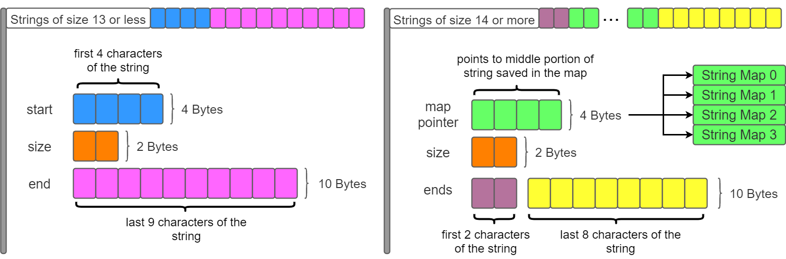

# Optimized string class for LiveHD, mmap_lib::str 

*Note*: pstr is short for mmap_lib::str.

---
## Class Structure
### I. Attributes
- `ptr_or_start`: 4 bytes, will store either a map pointer to a string map (size > 13), or the first 4 characters of the string (size <= 13).
- `e`: 10 bytes, stands for *ends*, will store either the first 2 and last 8 characters of the string (size > 13), or the last 10 characters of the string (size <= 13).
- `_size`: 2 bytes, size of the string.

### II. Memory-mapped  Persistence



---

## API Usage
### I. Constructors and Related Functions
#### **```str() {} //constructor 0```**:
- <ins>*inputs*</ins>: N/A
- <ins>*outputs*</ins>: a pstr of length zero.
- <ins>*description*</ins>: This pstr constructor simply creates an empty string, no ```mmap_lib::map``` is needed here since the string is less than 13 characters long.

#### **```str(char c) {} //constructor 0.5```**: 
- <ins>*inputs*</ins>: a character `c` that will be the contents of the pstr.
- <ins>*outputs*</ins>: a pstr of length 1, that is the input character c.
- <ins>*description*</ins>: This pstr constructor creates a pstr with just one character that reflects the `char c`, also no ```mmap_lib::map``` needed here cause length is not 14 or more.

#### **```int get_map_id() const {}```**: 
- <ins>*inputs*</ins>: N/A
- <ins>*outputs*</ins>: an integer that represents the ```map_id```, can be 0 to 3.
- <ins>*description*</ins>: This function returns the memory ```map_id``` that each pstr was created in.

#### **```static void clear_map() {}```**:
- <ins>*inputs*</ins>: N/A
- <ins>*outputs*</ins>: N/A
- <ins>*description*</ins>: his function clears the memory map corresponding to the ```map_id``` of the class that calls this function.

#### **```mmap_lib::map<std::string_view, bool> &map_ref() {}```**: 
- <ins>*inputs*</ins>: N/A
- <ins>*outputs*</ins>: a reference to the ```mmap_lib::map``` String Map that matches the ```map_id``` of the class.
- <ins>*description*</ins>: This function returns a reference to the ```mmap_lib::map``` that the current string is using, this is done using the ```map_id``` of the class.

#### **```mmap_lib::map<std::string_view, bool> &map_cref() const {}```**:
- <ins>*inputs*</ins>: N/A
- <ins>*outputs*</ins>: a const reference to a ```mmap_lib::map``` that matches the ```map_id``` of the class.
- <ins>*description*</ins>: This is the `const` verison of the above function, returns a `const` reference to the desired ```mmap_lib::map```.

#### **```uint32_t insertfind(const char *string_to_check, uint32_t size) {}```**:
- <ins>*inputs*</ins>:  
	- a `const char` array named `string_to_check` that represents the middle of a string that is longer than 13 characters, this array is the string without its first 2 and last 8 characters.
	- a 32 bit unsigned number named `size` that represents the size of the `const char` array input.
- <ins>*outputs*</ins>: a 32 bit unsigned number that represents the position in the ```mmap_lib::map``` that the `const char` array is stored at. **Note**, this position is the internal indexing of the map, and is used along with the ```mmap_lib::map``` iterator to quickly look up elements in the map.
- <ins>*description*</ins>: This function tries to find the `const char` array input (representing the middle portion of a string) in the ```mmap_lib::map``` specified by the ```map_id``` of the class. If the character array (which is first turned into a `string_view`) is not found in the map, then it is inserted into the map, and its map position returned. If the character array is found, then the position of discovery is returned.

#### **```str(const char (&s)[N]) {}//constructors 1 & 2```**:
- ```string size < 14```:
	- <ins>*inputs*</ins>: an array of `const char` literal references named `s` that will be used to create the string.
	- <ins>*outputs*</ins>: a pstr with contents of the `const char (&s)[N]`.
	- <ins>*description*</ins>: This is constructor 1, used for strings of ```_size``` < 14. This constructor does not touch any map, only ```e``` and ```ptr_or_start```. The first 4 characters are put in ```ptr_or_start```, and everything else is placed in ```e```. 
- ```string size >= 14```
	- <ins>*inputs*</ins>: (same as above)
	- <ins>*outputs*</ins>: (same as above)
	- <ins>*description*</ins>: This is constructor 2, used for strings of ```_size``` >= 14. This constructor access the maps and saves the first 2 and last 8 characters of the string in ```e```, and saves the longer/middle portion of the string as a ```string_view```within one of the maps. ```ptr_or_start``` points to the position in the map where the middle portion of the string is/can be accessed.

#### **```str(std::string_view) {}//constructor 3```**:
- <ins>*inputs*</ins>: a ```string_view```that will be the contents of the pstr. 
- <ins>*outputs*</ins>: a pstr that represents the inputted ```string_view```.
- <ins>*description*</ins>: This constructor is a combination of constructor 1 & 2. It can handle strings of any size, using the logic of constructor 1 for ```_size``` < 14, and the logic of constructor 2 for ```_size``` >= 14.


### II. Printing Functions

#### **```void print_PoS const {}```**
- <ins>*inputs*</ins>: N/A
- <ins>*outputs*</ins>: N/A
- <ins>*description*</ins>: Prints out the ```ptr_or_start``` variable of the string that called this function.

#### **```void print_e() const {}```**
- <ins>*inputs*</ins>: N/A
- <ins>*outputs*</ins>: N/A
- <ins>*description*</ins>: Prints out the array ```e``` of the string that called this function, which is at most 10 characters. These 10 chars will be different chars of the string depending on the length of the string.

#### **```void print_StrMap() const {}```**
- <ins>*inputs*</ins>: N/A
- <ins>*outputs*</ins>: N/A
- <ins>*description*</ins>: Prints out the String Map that is used by the string that called this function, the String Map can be either id 0, 1, 2, or 3.
#### **```void print_string() const {}```**
- <ins>*inputs*</ins>: N/A
- <ins>*outputs*</ins>: N/A
- <ins>*description*</ins>: Prints out the whole string.


### III. Auxiliary/Helper Functions
#### **```constexpr std::size_t size() const {}```**
- <ins>*inputs*</ins>: N/A
- <ins>*outputs*</ins>: a std::size_t value that represents the size (character count) of the string.
- <ins>*description*</ins>: Simply returns the internal class variable, ```_size```.

#### **```constexpr std::size_t length() const {}```**
- <ins>*inputs*</ins>: N/A
- <ins>*outputs*</ins>: (same as above, created to diversify user-choice and help with integration)
- <ins>*description*</ins>: (same as above)

#### **```constexpr std::size_t max_size() const {}```**
- <ins>*inputs*</ins>: N/A
- <ins>*outputs*</ins>: the value 65535, which is the largest our string can be. 
- <ins>*description*</ins>: Simply returns 65536 literal.

#### **```constexpr bool empty() const {}```**
- <ins>*inputs*</ins>: N/A
- <ins>*outputs*</ins>: a boolean that tells the user whether or not the string is empty, true for empty, false for not empty.
- <ins>*description*</ins>: Simply returns whether or not ```_size``` equals 0. 

#### **```constexpr uint32_t get_pos() const {}```**
- <ins>*inputs*</ins>: N/A
- <ins>*outputs*</ins>: a 32 bit unsigned number that is the ```ptr_or_start``` variable.
- <ins>*description*</ins>: Simply returns the ```ptr_or_start``` internal variable.

#### **```constexpr char get_e(uint8_t i) const {}```**
- <ins>*inputs*</ins>: a 8 bit unsigned number named `i` that represents which index of ```e``` to return.
- <ins>*outputs*</ins>: a char that is the *i*<sup>th</sup> index of ```e```.
- <ins>*description*</ins>: Simply returns the value of ```e``` at index *i*. 

#### **```constexpr std::size_t e_size() const {}```**
- <ins>*inputs*</ins>: N/A
- <ins>*outputs*</ins>: a std::size_t variable that represents how many characters are in ```e```.
- <ins>*description*</ins>: Simply returns the size of the internal variable ```e```. 

#### **```std::string to_s() const {}```**
- <ins>*inputs*</ins>: N/A
- <ins>*outputs*</ins>: a ```std::string``` that represents the same string as the pstr that called this function.
- <ins>*description*</ins>: This function creates an ```std::string```, and fills it with the contents of the pstr that called this function.

#### **```int64_t to_i() const {}```**
- <ins>*inputs*</ins>: N/A
- <ins>*outputs*</ins>: a 64 bit signed integer that represents the pstr turned into an integer. **Note**, if the pstr is not a number to begin with, this function will return 0.
- <ins>*description*</ins>: This function first checks if the pstr that called this function represents a number in string form, if it does, then the function turns the string representation of the numebr into the integer representation of the number and returns the integer.

#### **```bool is_i() const {}```**
- <ins>*inputs*</ins>: N/A
- <ins>*outputs*</ins>: a boolean value that represents whether or not the pstr that called this function is number in string form.
- <ins>*description*</ins>: If the pstr that called this function is a number in string form, (for example: "547" or "-12.88"), then this function returne true, otherwise it will return false.


### IV. Operators
#### **```template <int m_id>```**<br/>**```constexpr bool operator==(const str<m_id> &rhs) const {}```**
- <ins>*inputs*</ins>: another pstr named `rhs` to compare with.
- <ins>*outputs*</ins>: a boolean value that indicates whether or not the pstr's being compared are the same, true for same, false for different.
- <ins>*description*</ins>: This is one of the operations that pstr is designed to be fast for. The logic is split between two major sections, which depends whether or not the pstr's being compared are from the same String Map (i.e. were the two pstr's being compared created using the same ```map_id```). If the two pstr's being compared are from the same String Map, then all that needs to be done is a 64 bit compare (each pstr is 16 bytes of data, or 64 bits), which is very fast. If the two pstr's are from different String Maps, then the ```e``` array of both pstr's are compared, and then the ```string_view``` form of each pstr's middle portion is retrieved from each String map to be compared.

#### **```bool operator==(std::string_view rhs) const {}```**
- <ins>*inputs*</ins>: a ```string_view``` named `rhs` to be compared with.
- <ins>*outputs*</ins>: (same as above)
- <ins>*description*</ins>: This function simply turns `rhs` into a pstr and calls the previous ```==``` operator on the two pstr.

#### **```template <std::size_t N>```**<br/>**```constexpr bool operator==(const char (&rhs)[N]) const {}```**
- <ins>*inputs*</ins>: an array of references to `const char` literals named `rhs` to be compared with.
- <ins>*outputs*</ins>: (same as above)
- <ins>*description*</ins>: (same as above)

#### **```template <int m_id>```**<br/>**```constexpr bool operator!=(const str<m_id> &rhs) const {}```**
- <ins>*inputs*</ins>: another pstr named `rhs` to compare with.
- <ins>*outputs*</ins>: a boolean value that indicates whether or not the pstr's being compared are different, true for different, false for same.
- <ins>*description*</ins>: This function simply calls the `==` operator on the two pstr's and the negates the result.

#### **```bool operator!=(std::string_view rhs) const {}```**
- <ins>*inputs*</ins>: a ```string_view``` named `rhs` to be compared with.
- <ins>*outputs*</ins>: (same as above)
- <ins>*description*</ins>: (same as above)

#### **```template <std::size_t N>```**<br/>**```constexpr bool operator!=(const char (&rhs)[N]) const {}```**
- <ins>*inputs*</ins>: an array of references to `const char` literals named `rhs` to be compared with.
- <ins>*outputs*</ins>: (same as above)
- <ins>*description*</ins>: (same as above)

#### **```constexpr char operator[](std::size_t pos) const {}```**
- <ins>*inputs*</ins>: a `size_t` variable named `pos` that represents which index of the string needs to be accessed.
- <ins>*outputs*</ins>: the character that is at the `pos`<sup>th</sup> index of the pstr.
- <ins>*description*</ins>: This function identifies which portion of the string the desired character is from using the provided `pos` argument, and access the corresponding pstr internal variable to get the character.


### V. String Traversal/Search Functions
#### **```template <int m_id>```**<br/>**```bool starts_with(str<m_id> &st) const {}```**
- <ins>*inputs*</ins>: a pstr named `st` to be compared with.
- <ins>*outputs*</ins>: a boolean that represents whether or not the pstr that called this function starts with `st`, true for yes, false for no.  
- <ins>*description*</ins>: This function relies on the `[]` operator to walk through the pstr and `st`  starting from index 0 to see if there is mismatch when comparing each character. 

#### **```bool starts_with(std::string_view st) const {}```**
- <ins>*inputs*</ins>: a `string_view` named `st` to be compared with.
- <ins>*outputs*</ins>: (same as above)
- <ins>*description*</ins>: (same as above, except that `st` is a `string_view`, but can still use its own `[]`)

#### **```template <int m_id>```**<br/>**```bool ends_with(str<m_id> &en) const {}```**
- <ins>*inputs*</ins>: a pstr named `en` to be compared with.
- <ins>*outputs*</ins>: a boolean that represents whether or not the pstr that called this function ends with `st`, true for yes, false for no.  
- <ins>*description*</ins>: This function relies on the `[]` operator to walk through the pstr and `en` starting from index (size - 1) to see if there is mismatch when comparing each character. 

#### **```bool ends_with(std::string_view en) const {}```**
- <ins>*inputs*</ins>: a `string_view` named `en` to be compared with.
- <ins>*outputs*</ins>: (same as above)
- <ins>*description*</ins>: (same as above, except that `st` is a `string_view`, but can still use its own `[]`)

#### **```template <int m_id>```**<br/>**```std::size_t find(const str<m_id> &v, std::size_t pos=0) const {}```**
- <ins>*inputs*</ins>: 
  - a pstr named `v` that to be searched for inside the pstr that called this function. 
  - a `size_t` variable named `pos` that represents which index to starts the search at.
- <ins>*outputs*</ins>: a `size_t` variable that represents the first index that `v` was found at inside the pstr that called this function.
- <ins>*description*</ins>: This function first searches for the first character of `v` inside the pstr starting from index 0, if it is found, then the function proceeds to compare the rest of `v` with the characters of the pstr following the index of discovery. If `v` is exhausted before reaching beyond the pstr, then the index of discovery of `v`'s first character is returned. If any character of `v` and pstr mismatch, then -1 is returned. *Note*: -1 is also returned for any other case. 

#### **```std::size_t find(char c, std::size_t pos=0) const {}```**
- <ins>*inputs*</ins>: 
  - a character `c` to be searched for inside the pstr that called this function. 
  - a `size_t` variable named `pos` that represents which index to start the search.
- <ins>*outputs*</ins>: a `size_t` variable that represents the first index that character `c ` was found. 
- <ins>*description*</ins>: This function relies on the `[]` operator to walk through the pstr to compare the each character with `c`.

#### **```template <std::size_t N>```**<br/>**```constexpr std::size_t find(const char (&s)[N], std::size_t pos=0) {}```**
- <ins>*inputs*</ins>: 
  - an array of `const char` literal references named `s` to be searched for inside the pstr that called this function.
  - a `size_t` variable named `pos` that represents which index to start the search.
- <ins>*outputs*</ins>: a `size_t` variable that represents the first index that `s` was found. 
- <ins>*description*</ins>: This function simply calls the `find()` function from above for two pstr's by first turning `s` into a pstr.

#### **```template <int m_id>```**<br/>**```std::size_t rfind(const str<m_id> &v, std::size_t pos=0) const {}```**
- <ins>*inputs*</ins>: 
  - a pstr named `v` that to be searched for inside the pstr that called this function. 
  - a `size_t` variable named `pos` that represents which index to starts the search at.
- <ins>*outputs*</ins>: a `size_t` variable that represents the last index that `v` was found at inside the pstr that called this function.
- <ins>*description*</ins>: (placeholder).

#### **```std::size_t rfind(char c, std::size_t pos=0) const {}```**
- <ins>*inputs*</ins>: 
  - a character `c` to be searched for inside the pstr that called this function. 
  - a `size_t` variable named `pos` that represents which index to start the search.
- <ins>*outputs*</ins>: a `size_t` variable that represents the last index that character `c ` was found. 
- <ins>*description*</ins>: This function relies on the `[]` operator to walk through the pstr to compare the each character with `c`.

#### **```template <std::size_t N>```**<br/>**```constexpr std::size_t rfind(const char (&s)[N], std::size_t pos=0) {}```**
- <ins>*inputs*</ins>: 
  - an array of `const char` literal references named `s` to be searched for inside the pstr that called this function.
  - a `size_t` variable named `pos` that represents which index to start the search.
- <ins>*outputs*</ins>: a `size_t` variable that represents the last index that `s` was found. 
- <ins>*description*</ins>: This function simply calls the `rfind()` function from above for two pstr's by first turning `s` into a pstr.


### VI. String Modification Functions
#### **```template <int m_id>```**<br/>**```str append(const str<m_id> &b) {}```**
- <ins>*inputs*</ins>: a pstr named `b` that will be added on to the end of the pstr that called this function.
- <ins>*outputs*</ins>: a new pstr that represents the two strings combined.
- <ins>*description*</ins>: This function has two main branches of logic, one when the size of the pstr calling this function is <= 13, and another when size > 13. When the size is <= 13, the function creates new elements in memory map or simply fill in more of the string's internal structures depending on what the total size of the final combined string is. When the size > 13, we simply convert both pstr's to `std::string` and append them, then store the resulting `std::string` as a pstr to be returned.

#### **```str append(std::string_view b) {}```**
- <ins>*inputs*</ins>: a `string_view` variable named `b` that will be appended on to the back of the pstr that called this function.
- <ins>*outputs*</ins>: (same as above)
- <ins>*description*</ins>: This function simply calls the `append()` function from above after turning the `string_view` into a pstr.

#### **```str append(char c) {}```**
- <ins>*inputs*</ins>: a character `c` that will be appended onto the back of the pstr that called this function.
- <ins>*outputs*</ins>: (same as above)
- <ins>*description*</ins>: This function simply calls the `append()` function from above after turning the character into a pstr.

#### **```str append(int b) {}```**
- <ins>*inputs*</ins>: an integer `b` that will be appended onto the back of the pstr that called this function.
- <ins>*outputs*</ins>: (same as above)
- <ins>*description*</ins>: This function simply calls the `append()` function from above after turning the integer into a `std::string`, then into a pstr.

#### **```template <int m_id, int m_id2>```**<br/>**```static str concat(str<m_id> &a, const str<m_id2> &b) {}```**
- <ins>*inputs*</ins>: two pstr's that will be combined into one pstr, `a` first, then `b`.
- <ins>*outputs*</ins>: (same as above)
- <ins>*description*</ins>: This function converts both pstr's into `std::string` and then recombines them in order to avoid the case of two pstr's coming from different template classes.

#### **```template <int m_id>```**<br/>**```static str concat(std::string_view a, const str<m_id> &b) {}```**
- <ins>*inputs*</ins>: a pstr `b` and a `string_view` `a` that will be combined into one pstr, `a` first, then `b`.
- <ins>*outputs*</ins>: (same as above)
- <ins>*description*</ins>:  This function uses `a.append(b)` after converting the `string_view` to a pstr.

#### **```template <int m_id>```**<br/>**```static str concat(str<m_id> &a, std::string_view b) {}```**
- <ins>*inputs*</ins>: a pstr `a` and a `string_view` `b` that will be combined into one pstr, `a` first, then `b`.
- <ins>*outputs*</ins>: (same as above)
- <ins>*description*</ins>: (same as above)

#### **```template <int m_id>```**<br/>**```static str concat(str<m_id> &a, int v) {}```**
- <ins>*inputs*</ins>: a pstr `a` and an integer `v` that will combined into one patr, `a` first, then `v`.
- <ins>*outputs*</ins>: (same as above)
- <ins>*description*</ins>: This function just calls `a.append(v)` and returns the result.

#### **```std::vector<str> split(const char chr) {}```**
- <ins>*inputs*</ins>: a character `chr` that represents the character to split at, or start/end new pstr's at. 
- <ins>*outputs*</ins>: a `std::vector` of pstr's that represents the different sections the string that called this function split into using the delimiter `chr`.
- <ins>*description*</ins>: This is essentially a tokenizing function for pstr using `chr` as the delimiter. The internal logic of this function is traversing the pstr and checking for the delimiter. If the function sees a delimiter, it will save the current string and start a new string until another delimiter is hit, which will repeat the string creation process.


### VII. String Access Functions
#### **```str get_str_after_last(const char chr) const {}```**
- <ins>*inputs*</ins>: a character `chr` that is going to be used as the delimiter in this function.
- <ins>*outputs*</ins>: a pstr that represents the desired subsection of the string that called this function.
- <ins>*description*</ins>: This function gets the subsection of the pstr that is **after** the **last** instance of the character `chr`. It does this by using the `rfind()` function to search for the last position of `chr` in the pstr that called this function. Then we simply take the section after `chr`'s index and make a new pstr out of it.

#### **```str get_str_after_first(const char chr) const {}```**
- <ins>*inputs*</ins>: (same as above)
- <ins>*outputs*</ins>: (same as above)
- <ins>*description*</ins>: This function gets the subsection of the pstr that is **after** the **first** instance of the character `chr`. It does this by using the `find()` function to search for the first position of `chr` in the pstr that called this function. Then we simply take the section after `chr`'s index and make a new pstr out of it.

#### **```str get_str_before_last(const char chr) const {}```**
- <ins>*inputs*</ins>: (same as above)
- <ins>*outputs*</ins>: (same as above)
- <ins>*description*</ins>: This function gets the subsection of the pstr that is **before** the **last** instance of the character `chr`. It does this by using the `rfind()` function to search for the last position of `chr` in the pstr that called this function. Then we simply take the section before `chr`'s index and make a new pstr out of it.

#### **```str get_str_before_first(const char chr) const {}```**
- <ins>*inputs*</ins>: (same as above)
- <ins>*outputs*</ins>: (same as above)
- <ins>*description*</ins>: This function gets the subsection of the pstr that is **before** the **first** instance of the character `chr`. It does this by using the `find()` function to search for the first position of `chr` in the pstr that called this function. Then we simply take the section before `chr`'s index and make a new pstr out of it.

#### **```str substr(size_t start, size_t step) const {}```**
- <ins>*inputs*</ins>: 
  - a `size_t` variable named `step` that represents how many characters we want to take from the pstr that called this function.
  - a `size_t` variable named `start` that represents which index to start taking characters from in the pstr that called this function.
- <ins>*outputs*</ins>: the desired subsection of the pstr that called this function as a new pstr.
- <ins>*description*</ins>: This function splits its logic based on which index to start at in the pstr , as well as what the anticipated length of the substring is. Different starting index will change which of the pstr's internal structures to access, and different substring lengths will change how the new pstr is to be created and stored. At the end, the desired substring is returned if the inputs are within the allowable range.

#### **```str substr(size_t start) const {}```**
- <ins>*inputs*</ins>: (same as second variable above)
- <ins>*outputs*</ins>: (same as above)
- <ins>*description*</ins>: This function simply uses the function above, except it does not allow users to input `step`. Instead, `step` is set to be the length of the pstr minus `start`, which is the remaining length after `start`. 


---


